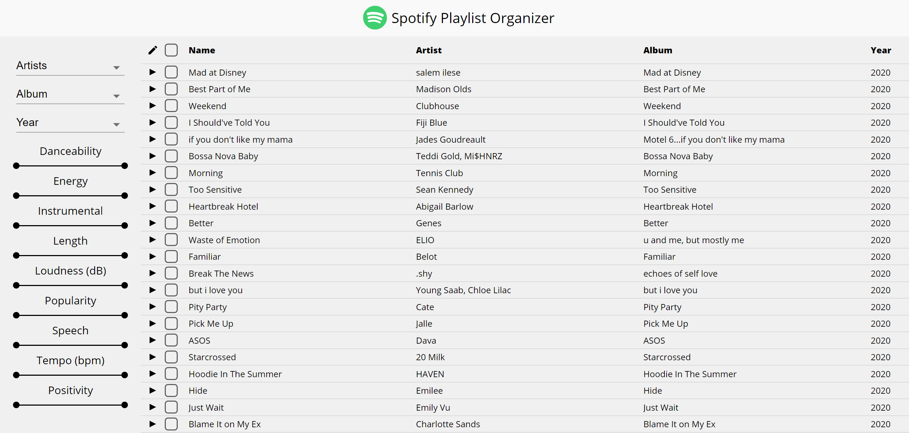

# [Spotify Playlist Organizer](https://plim1025.github.io/spotify-playlist-organizer.github.io/)
Filter your music based on attributes such as beats per minute, mood, popularity, and more  
Built with MERN stack



## Installation
```
yarn install-all
```
## Run locally
```
yarn dev
```
## Deploy
```
git push heroku master
```
